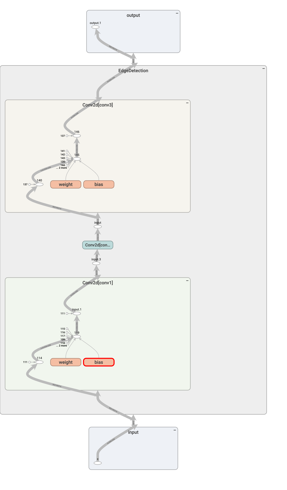
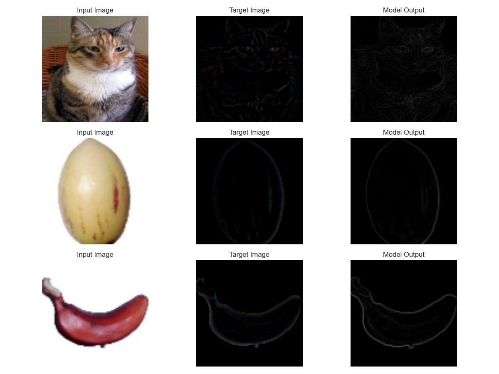
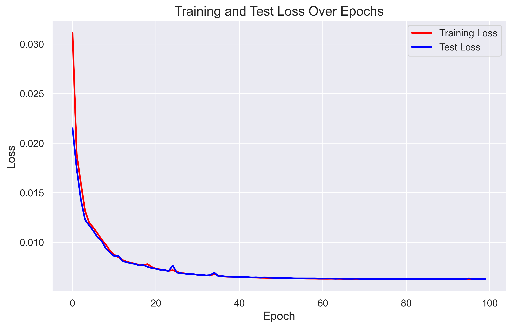
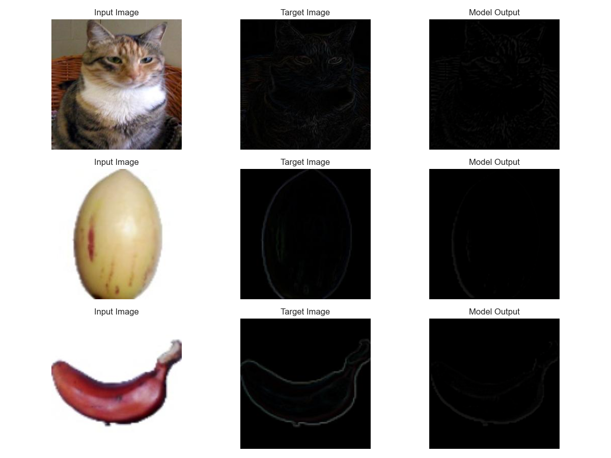
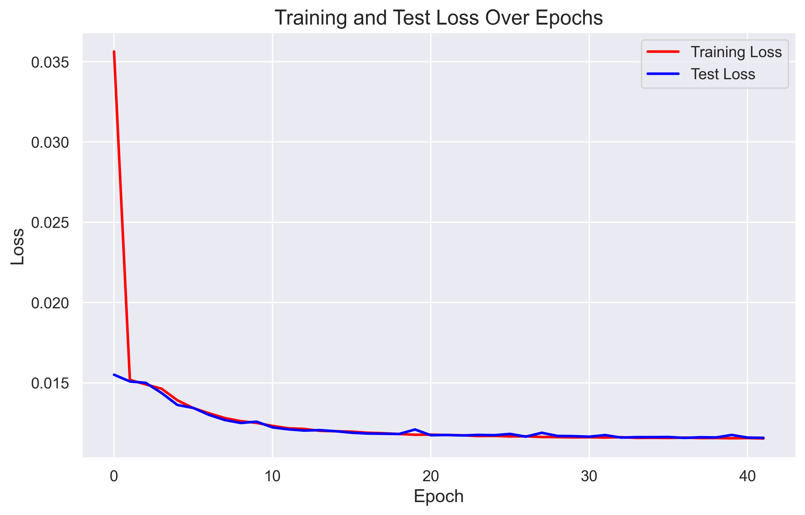

# Convolutional Neural Networks for Edge Detection
Submission for the Intermediate Machine Learning Task for What The Hack 2024.

## Edge Detection
Edge detection is a fundamental tool in image processing, machine learning, and computer vision, particularly in the areas of feature detection and extraction. It is used to detect the boundaries of objects within images. Edge detection is a critical step in image processing, as it allows us to identify objects and shapes within an image. It is also used in various applications, such as image segmentation, object recognition, and image compression.

### Convolution
When applying edge detection algorithms to real-world images, we face a challenge due to the difference between theoretical continuous functions and the discrete nature of pixel values. To approximate the derivative of pixel intensity in a 2D image, we employ a convolution operation.

A convolution involves using a small matrix, called a kernel, to perform calculations on the image. The center of the kernel, known as the anchor, plays a crucial role in the calculations. 

### Sobel Operator
The Sobel operator is a popular edge detection filter that is used to detect edges in images. It consists of two 3x3 kernels, known as the Sobel kernels, which are convolved with the image to compute the gradient in the x and y directions.\
Vertical Sobel Kernel (approximates change in the y-direction):
$
\begin{bmatrix}
-1 & -2 & -1\\
0 & 0 & 0\\
1 & 2 & 1
\end{bmatrix}
$\
Horizontal Sobel Kernel (approximates change in the x-direction):
$
\begin{bmatrix}
-1 & 0 & 1\\
-2 & 0 & 2\\
-1 & 0 & 1
\end{bmatrix}
$\
The gradient magnitude is then computed as the square root of the sum of the squares of the gradients in the x and y directions. The gradient direction is computed as the arctangent of the ratio of the gradients in the y and x directions. The Sobel operator is commonly used in edge detection tasks due to its simplicity and effectiveness.

### Prewitt Operator
The Prewitt operator is another edge detection filter that is used to detect edges in images. It is similar to the Sobel operator but uses different kernels to compute the gradient in the x and y directions.\
Vertical Prewitt Kernel (approximates change in the y-direction):
$
\begin{bmatrix}
-1 & -1 & -1\\
0 & 0 & 0\\
1 & 1 & 1
\end{bmatrix}
$\
Horizontal Prewitt Kernel (approximates change in the x-direction):
$
\begin{bmatrix}
-1 & 0 & 1\\
-1 & 0 & 1\\
-1 & 0 & 1
\end{bmatrix}
$

The Sobel and Prewitt operators are extremely similar so I will be working with only the Sobel operator. 

There are although a few key differences between the two operators:
- The Prewitt operator is more sensitive to horizontal and vertical edges, while the Sobel operator is more sensitive to diagonal edges. 
Edge visibility
- The Sobel operator can make edges more visible than the Prewitt operator because it gives more weight to pixel intensities around the edges. 
- The Prewitt operator doesn't emphasize pixels closer to the center of the mask, unlike the Sobel operator. 
### Laplacian Method

The Laplacian method is a more sophisticated approach to edge detection compared to simply looking for peaks in the first derivative. It involves analyzing the rate of change of the slope itself.

By examining the second derivative, which is the rate of change of the first derivative, we can identify points where the slope crosses zero. These points likely correspond to edges.

The Laplacian algorithm uses a kernel that approximates the second derivative. Unlike the Sobel algorithm, the Laplacian kernel is symmetrical, meaning rotating it doesn't change its shape. This simplifies the calculations involved in edge detection.

The Laplacian kernel: $
\begin{bmatrix}
-1 & -1 & -1\\
-1 & 8 & -1\\
-1 & -1 & 1
\end{bmatrix}
$

In essence, the Laplacian method helps distinguish between significant edges and noise by setting a threshold for the magnitude of the second derivative. If the magnitude exceeds the threshold, it's considered an edge.

## Convolutional Neural Networks
Convolutional Neural Networks (CNNs) are a type of deep learning model that is commonly used for image processing tasks. CNNs are particularly well-suited for tasks such as image classification, object detection, and image segmentation. CNNs are composed of multiple layers, including convolutional layers.Convolutional layers are used to extract features from the input image. These layers apply a set of filters (kernels) to the input image to detect patterns and features. The filters are learned during the training process, allowing the model to automatically learn the most relevant features for the task at hand.

Here's a tensorboard visualization of the CNN architecture I used for edge detection:

I have chosen to use L1 Loss and Adam optimizer for training the model.
- The L1 loss can be beneficial for edge detection tasks because it is less sensitive to outliers (noisy pixels) that might be present in images. This can help the model focus on the most salient edges and avoid being distracted by noise.
- The adaptive nature of Adam can help the model efficiently learn the complex patterns and features associated with edges in images.

During training I use the `CosineAnnealingLR` scheduler.
- By gradually reducing the learning rate, the model can converge more slowly and avoid overfitting.
- The cosine annealing schedule allows the model to explore the parameter space more thoroughly at the beginning of training and then gradually focus on exploiting the best solutions found.
- The learning rate starts at the initial value set for the optimizer.
- It follows a cosine curve, decreasing gradually to zero over the specified `T_max` epochs.

## Results
### Model Performance on learning a Sobel Filter 
 

### Model Performance on learning a Laplacian Filter

